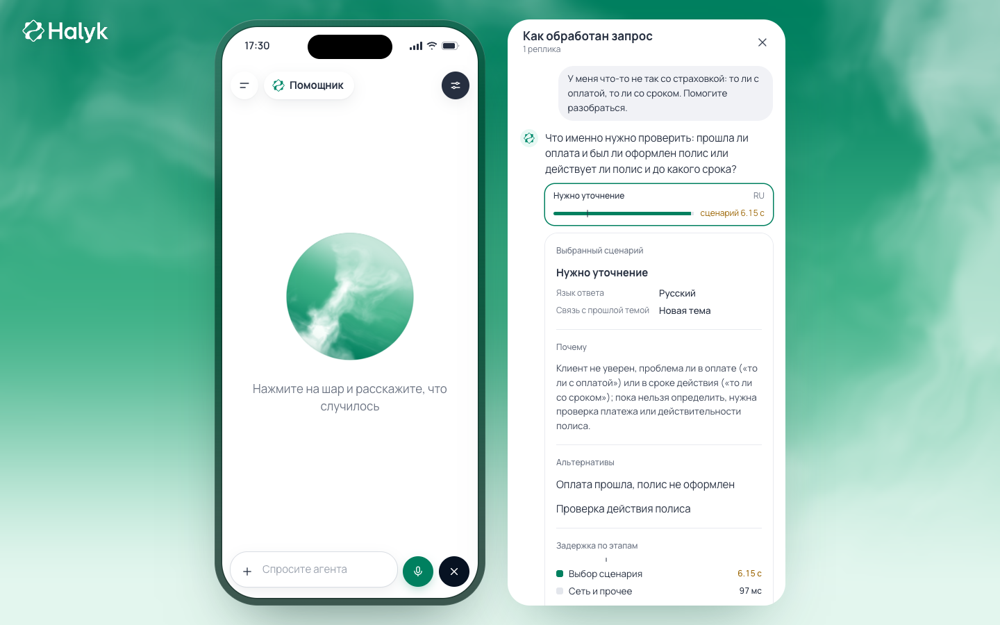

# Saqta Voice

### Voice support that follows the conversation.

A customer rarely speaks in neat menu options. They explain a problem in their own words, remember a second question halfway through, or switch from Russian to Kazakh. Saqta Voice is a web-based insurance assistant built for that conversation: it listens, chooses a service scenario, responds aloud, and shows a supervisor why it made that choice.

Built by Team 404 for **HackAlem AI · Halyk Bank · Case 2: Voice Router**. Saqta Insurance and its customer records are fictional materials supplied for the challenge; this app is not connected to real Halyk Bank accounts.



## The problem

Traditional voice menus make the customer translate a real problem into one of a few prepared phrases. That breaks down when a request sits between two topics, the customer changes their mind, or both languages appear in the same conversation. A wrong turn means repeating the story or waiting for a person.

Saqta Voice moves the decision from a fixed phrase classifier to a language-model routing layer. The assistant can handle natural speech while a supervisor sees the selected scenario, other possibilities, the reason, and how long each stage took. The important result is not just a pleasant voice; it is a better decision about what the customer needs.

## Try the hosted app

**[Open Saqta Voice](https://hackalem-137-74-166-29.sslip.io/)**

This is a temporary, shared hackathon login for reviewers of this private repository. It is **not** an OpenAI or Gemini API key.

```text
Username: hackalem
Password: SaqtaVoice-404-7E2M-9Q6P-2026
```

Allow microphone access and speak in Russian or Kazakh. Text input is available as a secondary path. A useful first request is: “Я оплатил полис, но он не активен. Что мне делать?” Then ask a follow-up or change topic. Open **Как обработан запрос** to see the transcript, chosen scenario, explanation, alternatives, and stage timings. The sidebar includes a supervisor view for reviewing routing decisions.

The URL has a valid HTTPS certificate. We verified the public page, authentication boundary, a real text-to-routing-to-answer flow, and creation of a Gemini voice-session token on the hosted server. A complete hosted microphone-to-spoken-answer conversation still needs a person to check it in a browser; the token check alone does not prove that flow.

## What the product does

Gemini Live handles streaming microphone input, spoken responses, language switching, and interruption. Insurance requests go to an OpenAI `gpt-6-luna` routing layer that compares the conversation with the **40 original scenarios in the official starter kit**. The backend uses the supplied company knowledge and sample records for business answers. A backend session retains up to ten customer turns.

When the request is ambiguous, the assistant asks a natural clarifying question instead of reciting internal scenario names. When a customer changes topic, the routing layer can switch while retaining context. Sensitive changes require a separate interpreted confirmation turn. If the assistant cannot resolve a request, it can prepare a local handoff record; this prototype does **not** connect a live operator.

The trace is visible after each routed turn: transcript, human-readable scenario, reason, alternatives, and measured processing stages. Technical IDs remain available in the API but are not shown in the ordinary interface.

## Run locally

You need Python 3.12, [uv](https://docs.astral.sh/uv/), Node.js 20+, npm, and server-side `OPENAI_API_KEY` and `GEMINI_API_KEY`. Provide the keys through your shell or a secret manager; do not add them to `frontend/.env` or commit them to Git.

From the repository root:

```bash
bash scripts/run-local.sh
```

Open <http://localhost:5173> and allow microphone access. The command installs the locked local dependencies and starts both the API and web app. If a provider is unavailable, the app reports the failure; it does not silently switch to a prerecorded conversation.

For the hosted build, the tracked [Dockerfile](Dockerfile) and [Compose service](deploy/compose.yml) run a Git-SHA-tagged image behind HTTPS. Provider keys and `VOICE_ROUTER_BASIC_AUTH` are set only in the server runtime environment; no container port is published directly. The login above is a temporary shared demo credential and should be changed after review.

## How it works

```text
Customer voice → Gemini Live (listening and speech)
               → Voice Router API → OpenAI routing across 40 scenarios
                                  → starter-kit facts and case actions
               → spoken answer + supervisor trace
```

The backend owns scenario selection and business facts; Gemini speaks the returned answer naturally. Case actions use the organizer's synthetic data. Irreversible changes require explicit confirmation. The browser receives only a short-lived Gemini session token; the provider API keys remain server-side.

The [HTTP contract](docs/BACKEND_API.md) describes the API. The [Russian functional plan](docs/VOICE_ROUTER_PLAN_RU.md) explains decision boundaries. Source code lives in [`backend/voice_router`](backend/voice_router) and [`frontend`](frontend); the organizer's starter kit is preserved in [`data/voice_router_dataset`](data/voice_router_dataset).

## What has been checked

The official development set contains 104 labeled utterances. The selected router returned the exact ordered route for **104/104** in the recorded development run. That set informed development, so this is **not** an estimate of accuracy on the jury's hidden ten utterances. A separate [real-voice check](docs/experiments/2026-09-23-real-voice.md) routed **11/11 scorable recordings** from two team members as expected. The [Luna/Sol comparison](docs/experiments/2026-09-23-luna-sol-routing.md) records the model choice and measured latency.

You can re-run the organizer's evaluator on the recorded development predictions without a paid API call:

```bash
uv run python data/voice_router_dataset/evaluate.py \
  docs/experiments/results/luna-dev-predictions.json \
  data/voice_router_dataset/dev_utterances.json
```

The hosted text path was checked through the actual HTTPS page and API. Recent hosted scenario selections varied from about **3 to 12 seconds**, including an 11.7-second request immediately after a release; we have not established a stable production median. This is above the specification's **500 ms** bonus target. End-of-speech to first audio has not been measured reliably in the hosted browser, so we do not claim the **1.5 s** bonus. The earlier sequential STT/TTS timings in the real-voice report are not Gemini Live browser timings.

## What we would build next

Five hours is enough to prove the product direction, not to finish every contact-center integration. The clearest next win is speed. We would test **Jev as a fast typed decision layer** for narrow, low-risk checks such as whether a second ambiguity review or slot-extraction pass is needed, while keeping the language model responsible for selecting the business scenario. In parallel, we would shorten the routing context and overlap independent work with the streaming voice session. Our engineering target is to move common requests from the current multi-second range toward **1–2 seconds** without losing Russian/Kazakh or multi-intent accuracy. That is a target for the next measured experiment, not a speedup we claim to have achieved.

We would then add precise end-of-speech-to-first-audio measurement in the browser, a persistent case history, a real operator handoff carrying the conversation context, and an editor for the scenario catalog. Each change has a clear acceptance check: compare accuracy and p50/p95 latency on new speech, verify the operator receives the right context, and require confirmation before any real-world change. The current product already exposes the trace needed to make those improvements measurable.

## Data, safety, and scope

The 40 scenarios, company facts, and sample customer records come from the official HackAlem starter kit. They are synthetic. OpenAI and Gemini are external AI services; no real customer recordings or bank data are used here.

This is a contest prototype, not a live contact center. Actions affect only in-process sample records; it does not charge cards, send SMS, book a real clinic, or connect a live operator. Sessions reset when the server restarts. Real customer use would need production authentication, privacy controls, persistent case history, rate limiting, and operator integration.

## Why this can extend beyond the challenge

The routing layer reads a scenario catalog instead of hard-coded test phrases. A future team could replace the fictional catalog and sample actions with approved products, knowledge, and service integrations while retaining the voice and supervisor experience. That migration would require a fresh accuracy, latency, security, and human-handoff evaluation.

## Sources and third-party components

- [HackAlem Case 2 technical specification](https://docs.google.com/document/d/1e-F3ahQwPSdRMugpLO1vQ0_gFf5q9hIATUt0GxC3bEM/edit), [official starter kit](https://drive.google.com/file/d/1sHE56gXnzdscHz5lMcNbwd1VsJIVLFUv/view), and [regulations](https://edu.astanahub.com/hackathons/df4743f5-c492-415c-b45a-1f13adb78e06?tab=regulations)
- React and Vite (MIT), Google Gen AI SDK and OpenAI Python SDK (Apache-2.0), and Pydantic (MIT) are third-party components. These license identifiers were checked against the installed package metadata. `frontend/package-lock.json` and `uv.lock` record the local dependency resolution; hosted Python packages are built from the ranges in `pyproject.toml`. Model use is governed by each provider's service terms.

Team 404 built the contest-specific routing, dialogue, actions, API, and web experience in the official repository. Organizer data and third-party components are identified above rather than presented as team-created assets.
